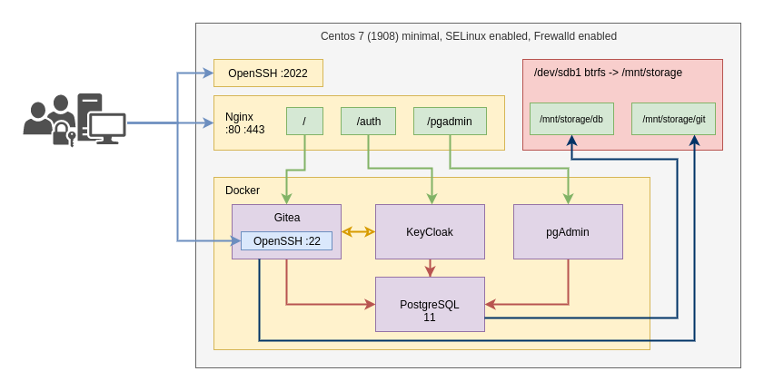

# Задача по установке Gitea c SSO и pgAdmin

- [Задача по установке Gitea c SSO и pgAdmin](#%d0%97%d0%b0%d0%b4%d0%b0%d1%87%d0%b0-%d0%bf%d0%be-%d1%83%d1%81%d1%82%d0%b0%d0%bd%d0%be%d0%b2%d0%ba%d0%b5-gitea-c-sso-%d0%b8-pgadmin)
  - [Тестовый стенд](#%d0%a2%d0%b5%d1%81%d1%82%d0%be%d0%b2%d1%8b%d0%b9-%d1%81%d1%82%d0%b5%d0%bd%d0%b4)
  - [Схема](#%d0%a1%d1%85%d0%b5%d0%bc%d0%b0)
  - [Рекомендуемое ПО для установки](#%d0%a0%d0%b5%d0%ba%d0%be%d0%bc%d0%b5%d0%bd%d0%b4%d1%83%d0%b5%d0%bc%d0%be%d0%b5-%d0%9f%d0%9e-%d0%b4%d0%bb%d1%8f-%d1%83%d1%81%d1%82%d0%b0%d0%bd%d0%be%d0%b2%d0%ba%d0%b8)
  - [Рекомендуемые docker контейнеры](#%d0%a0%d0%b5%d0%ba%d0%be%d0%bc%d0%b5%d0%bd%d0%b4%d1%83%d0%b5%d0%bc%d1%8b%d0%b5-docker-%d0%ba%d0%be%d0%bd%d1%82%d0%b5%d0%b9%d0%bd%d0%b5%d1%80%d1%8b)
  - [Требования](#%d0%a2%d1%80%d0%b5%d0%b1%d0%be%d0%b2%d0%b0%d0%bd%d0%b8%d1%8f)
  - [Бонусное задание](#%d0%91%d0%be%d0%bd%d1%83%d1%81%d0%bd%d0%be%d0%b5-%d0%b7%d0%b0%d0%b4%d0%b0%d0%bd%d0%b8%d0%b5)
  - [Подтверждение выполнения](#%d0%9f%d0%be%d0%b4%d1%82%d0%b2%d0%b5%d1%80%d0%b6%d0%b4%d0%b5%d0%bd%d0%b8%d0%b5-%d0%b2%d1%8b%d0%bf%d0%be%d0%bb%d0%bd%d0%b5%d0%bd%d0%b8%d1%8f)

## Тестовый стенд

Установку выполняем в виртуальной машине [Сentos 7.7.1908 minimal](http://mirror.yandex.ru/centos/7.7.1908/isos/x86_64/CentOS-7-x86_64-Minimal-1908.iso) или новее 7-ой версии, с последующей передачей образа в виде `VHD` или `VMDK`, либо в форомате Parallels Desktop.

Дополнительно создаем диск, с одним разделом с файловой системой `BTRFS` для размещения БД и артефактов, монитруем в `/mnt/storage`

## Схема

## Рекомендуемое ПО для установки

- logrotate
- nginx
- docker
- docker-compose
- openssh-server
- openssl

## Рекомендуемые docker контейнеры

- gitea/gitea:1.11
- jboss/keycloak:9.0.2
- postgres:11
- dpage/pgadmin4:4

## Требования

- **SELinux** должен быть в режиме `Enforced`
- **Firewalld** должен быть включен
- **SSH** опубликован на порт 2022, доступ `root` пользователя только по ключу
- **Контейнеры** запускаются из одного `docker-compose` и отедльного пользователя `ops`, данные хранятся в `/mnt/storage`
- **Gitea**:
  - Доступен по HTTPS с самоподписанным сертификатом, HTTP перенаправляет на HTTPS, путь публикации `/`
  - Авторизация реализована через KeyCloak
  - SSH опубликован на порту 22
- **KeyCloak** доступен по HTTPS с самоподписанным сертификатом, HTTP перенаправляет на HTTPS, путь публикации `/auth`
- **PostgreSQL**:
  - БД для KeyCloak
  - БД для Gitea
  - Недоступен из внешней сети
- **pgAdmin** доступен по HTTPS с самоподписанным сертификатом, HTTP перенаправляет на HTTPS, путь публикации `/pgadmin`
- **Docker**:
  - Использует ФС драйвер overlay2
  - Журналы ротируются по 10 mb 10 шт.
- **Nginx**
  - Пишет логи для каждого сервиса в свой файл.
  - `/pgadmin` доступен только для всех диапазонов адресов локальных сетей.

## Бонусное задание

- Добавить в инсталяцию контейнер с jenkins и jenkins agent, опубликовать по маршруту `/jenkins`, подключен для авторизации через Keycloak и установлен модуль Gitea.
- Написать Ansible роль для подготовки узла и компонентов, запуск docker-compose.
- Реализовать авторизацию в pgAdmin через KeyCloak
- Настроить fail2ban
- Установить netdata, и настроить сбор метрик PostgreSQL

## Подтверждение выполнения

Продемонстрировать работу локально запущенного стенда, передать образ ВМ при наличии такой возможности.

Приложить:

- `docker-compose.yml`
- конфигурацию `nginx`
- конфигурацию `sshd`
- правила фаервола
- роль ansible при наличии таковой
- конфигурация fail2ban при наличии таковой
- дополнительные файлы конфигурации на ваше усмотрение
